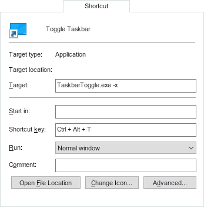

# ToggleTaskbar
Toggles the "Automatically hide the taskbar" setting and optionally hides it completely.

## Usage
- build or download [TaskbarToggle.exe](../../releases/download/v1.0/TaskbarToggle.exe)
- create a shortcut in your start menu and give it a Shortcut key, e.g.:
- 
- add the `-x` argument to completely hide the taskbar
- to override toggling, you can use `-v` to always show or `-h` to always hide

## Troubleshooting
- hiding only works when launched via Shortcut key (it assumes it's launched within the same process)
- if the Shortcut key lags about 3 seconds, disabling "Let apps run in the background" usually fixes it ([see this answer for more..](https://superuser.com/a/957210/116743))
